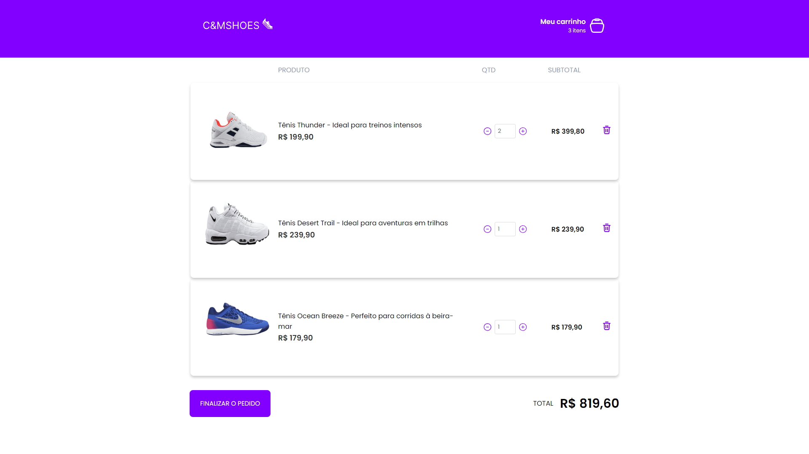

  

---

### Descrição

Este projeto é a solução de um desafio do curso de React da empresa <a href="https://app.rocketseat.com.br/">Rocketseat.</a> Nele, foi pedido uma aplicação que focasse apenas na criação de um hook que gerenciasse o carrinhos de compras.

A aplicação é uma forma básica de e-commerce, onde são vendidos calcados, em geral. Optei em utilizar apenas imagens de sapatos para ficar algo mais agradável visualmente. Sobre o carrinho, ao clicar no botão adicionar ao carrinho, o produto será enviado para o carrinho, onde no header irá mostrar apenas os diferentes itens que estão dentro do carrinho e no carrinho do produto irá mostrar a quantidade daquele produto dentro do carrinho. Na página do carrinho, temos a descrição do produto, botoes que incrementam e decrementam a quantidade do mesmo, o subtotal que aquele produto está gerando e uma lixeira que remove todas as cópias daquele produto do carrinho.

### Tecnologias utilizadas no projeto

- NodeJs
- React
- Mirage.js
- Styled Components
- Typescript
- Entre outros

---

## Home

## Cart

